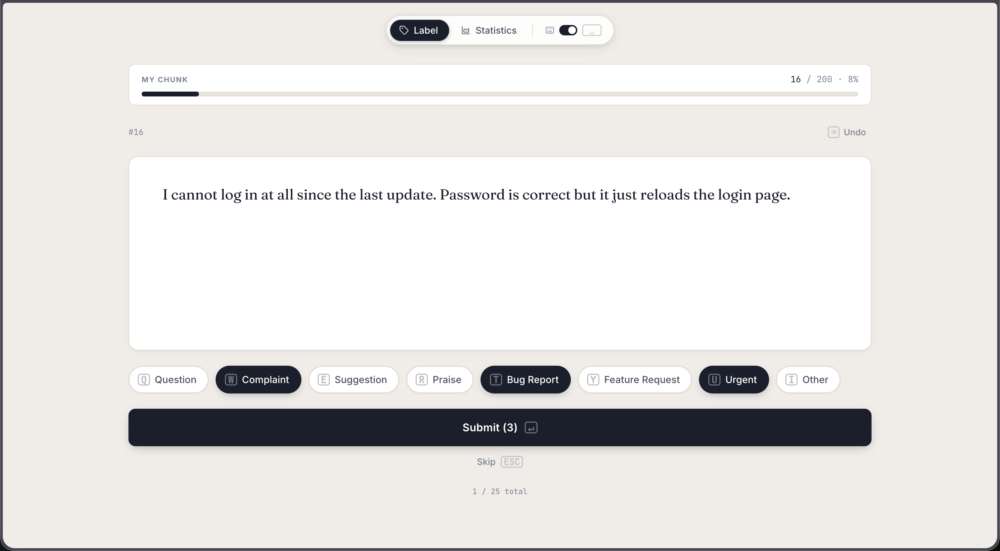
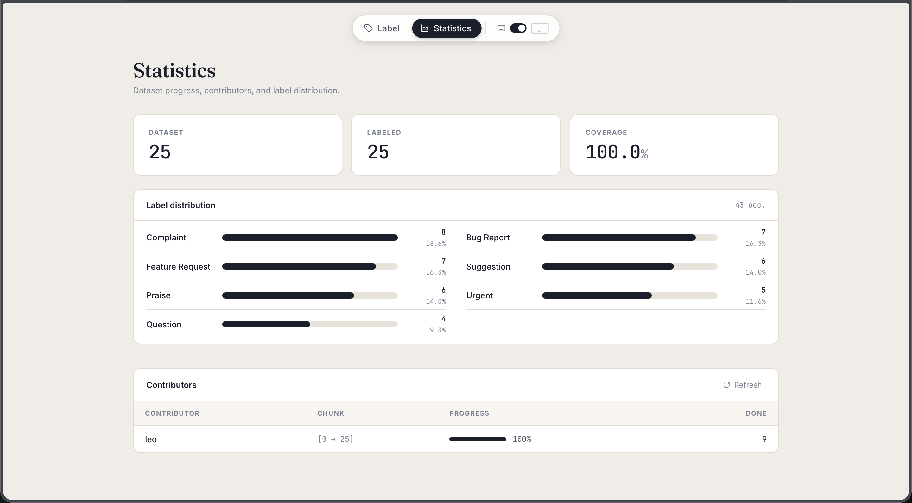

# Labelr

Self-hosted text labeling tool for multi-label classification. Multiple contributors can annotate text items in parallel, each working on their own chunk.

Built with **FastAPI** + **React/Vite**, runs entirely in Docker Compose — no external dependencies.

**Try it live → [labelr.novationlabs.fr](https://labelr.novationlabs.fr)**

> **Don't want to read through the code?** Open this repo in [Claude Code](https://claude.ai/code), ask it to read `README.md` and `docs/CLAUDE.md`, and it will understand the full project instantly — architecture, pitfalls, and all.

<table>
  <tr>
    <td align="center" width="50%">
      
      <sub><b>Labeling interface</b></sub>
    </td>
    <td align="center" width="50%">
      
      <sub><b>Statistics dashboard</b></sub>
    </td>
  </tr>
</table>

## Features

- **Multi-label** annotation: assign one or more classes per item
- **Chunk-based** work allocation: each contributor gets their own slice of the dataset
- **Keyboard shortcuts** for fast labeling (QWERTY or AZERTY, configurable via `.env`)
- **Shuffle mode**: randomize label order at startup and after each submit to avoid position bias
- **Live statistics**: coverage, label distribution, per-contributor progress
- **Append-only storage**: JSONL files, no database required
- **Hot reload** in development: edit code, see changes instantly
- **Export** to JSON with all annotations

## Quick start

```bash
# 1. Clone
git clone https://github.com/NovationLabs/labelr.git
cd labelr

# 2. Configure
cp .env.example .env
# Edit .env: set your labels, ports, keyboard layout, shuffle mode

# 3. Add your dataset
# Create data/dataset.jsonl — one JSON object per line, must have "index" and "text" fields:
# {"index": 0, "text": "Your first text item"}
# {"index": 1, "text": "Your second text item"}

# 4. Start
docker compose up -d
```

- Frontend: http://localhost:3000
- Backend API: http://localhost:8000

## Configuration (`.env`)

| Variable | Default | Description |
|---|---|---|
| `FRONTEND_PORT` | `3000` | Host port for the frontend |
| `BACKEND_PORT` | `8000` | Host port for the backend API |
| `ALLOWED_HOST` | `your-domain.com` | Domain added to Vite's allowedHosts |
| `KEYBOARD_LAYOUT` | `QWERTY` | Shortcut layout: `QWERTY` or `AZERTY` |
| `CHUNK_SIZE` | `10` | Number of items per labeler chunk |
| `SHUFFLE` | `False` | Randomize label order at startup and after each submit (`True` or `False`) |
| `EXPORT_TOKEN` | _(empty)_ | If set, required as `?token=` query param on `/export`. Leave empty to disable. |
| `LABELS` | default set | JSON array of label strings |

Example `LABELS`:
```
LABELS=["Positive","Negative","Neutral","Other"]
```

## Dataset format

Each line in `dataset.jsonl` must be a valid JSON object with at minimum:

```json
{"index": 0, "text": "Text to label"}
```

The `index` field must be a sequential integer starting at 0. All additional fields are preserved in the export.

## Keyboard shortcuts

| Key | Action |
|-----|--------|
| `Tab` | Switch between Label and Statistics views |
| `Space` | Toggle keyboard shortcuts on/off |
| `Q W E R T Y …` | Select/deselect labels (QWERTY layout) |
| `A Z E R T Y …` | Select/deselect labels (AZERTY layout) |
| `Enter` | Submit annotation |
| `Esc` | Skip item |
| `Backspace` | Undo last annotation |

Set `KEYBOARD_LAYOUT=AZERTY` in `.env` to switch layout.

## Data storage

All data is stored as append-only JSONL files in the `data/` directory:

| File | Description |
|------|-------------|
| `dataset.jsonl` | Your source dataset (you provide this) |
| `labels.jsonl` | All annotations (one line per submission) |
| `progress.jsonl` | Per-contributor chunk progress |

The last annotation per item index wins (overwrites are supported by re-submitting).

## Export

Download all annotations as JSON:

```bash
curl "http://localhost:3000/api/export?token=your_token" > annotations.json
```

## Architecture

```
labelr/
├── backend/
│   ├── main.py
│   ├── Dockerfile
│   └── requirements.txt
├── frontend/
│   └── src/
│       ├── App.jsx
│       └── index.css
├── data/
│   ├── dataset.jsonl
│   ├── labels.jsonl
│   └── progress.jsonl
└── docker-compose.yml
```

## Hosting behind a custom domain

If you expose the frontend via a reverse proxy or tunnel (e.g. Cloudflare Tunnel, nginx), set `ALLOWED_HOST` in your `.env`:

```
ALLOWED_HOST=labelr.yourcompany.com
```

Without this, Vite will block requests with a "host not allowed" error.

## Development

Hot reload is enabled by default:
- **Frontend**: Vite HMR — edit `frontend/src/`, changes appear instantly
- **Backend**: uvicorn `--reload` — edit `backend/main.py`, reloads automatically
- No `docker compose build` needed for code changes

After modifying the dataset file, restart the backend (it keeps the dataset in memory):

```bash
docker compose restart backend
```
